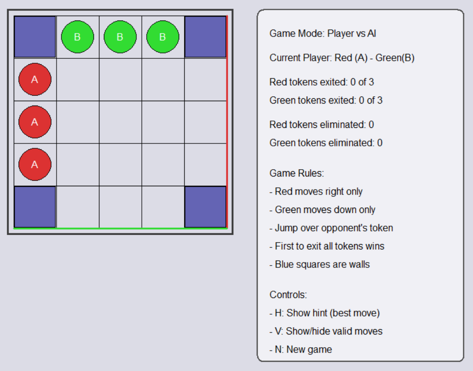
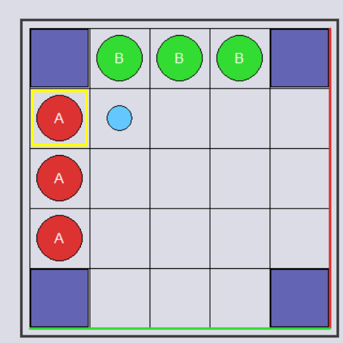
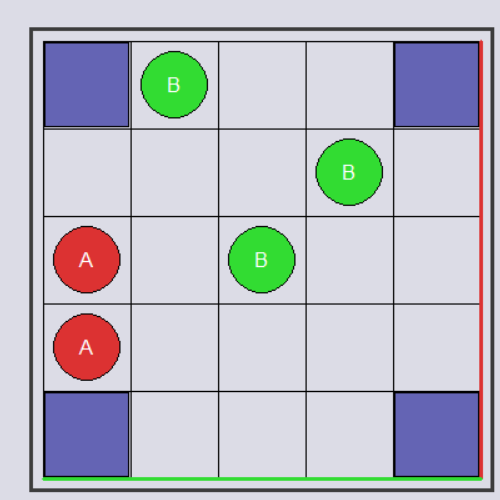

# Game Tree Alpha-Beta Board Game

A Windows C++ board game that demonstrates game-tree search, recursive backtracking, minimax-style decision making, and alpha-beta pruning through a playable grid-based strategy game.

The project combines a Win32/GDI desktop interface with an AI move-selection engine. The human player controls the red tokens, while the AI controls the green tokens and evaluates future states before choosing its next move.

## Screenshots



| Valid move highlight | AI jump capture |
| --- | --- |
|  |  |

## Features

- Playable 5x5 board-game implementation using native Windows UI APIs.
- Player-vs-AI mode enabled by default.
- Game-tree search with recursive move exploration.
- Alpha-beta pruning to reduce unnecessary branch evaluation.
- Heuristic board evaluation based on token count, progress, jump opportunities, walls, and clear paths.
- Hint support that highlights the current best move.
- Valid-move highlighting for selected tokens.
- Custom `Move` and `Stack` data structures used by the game logic.

## Gameplay Summary

The board is a 5x5 grid with blocked wall squares in the corners. Each player starts with three tokens:

- Red tokens move horizontally to the right.
- Green tokens move vertically downward.
- A regular move advances one square into an empty cell.
- A jump move advances two squares over an opposing token and removes that token.
- A player wins by exiting all tokens through the target edge or by eliminating all opposing tokens.

The AI evaluates legal moves from the current position, searches ahead through future board states, and selects the strongest move returned by the alpha-beta search.

## Algorithm

The main AI logic is implemented in `include/GameTree.h`.

`GameTree` stores the board state, current player, exited-token counts, wall positions, and search depth. For each turn, it:

1. Generates all valid moves for the current player.
2. Applies each move to create a future state.
3. Searches recursively with `alphaBetaMax` and `alphaBetaMin`.
4. Prunes branches when alpha-beta bounds prove they cannot improve the result.
5. Scores leaf states with `evaluatePosition`.
6. Returns the best move through `findBestMoveWithBacktracking`.

The evaluation function rewards strong board positions, token progress toward exits, jump opportunities, and clear paths while penalizing vulnerable or blocked positions.

## Complexity

For a search depth `d` and branching factor `b`, the worst-case search cost is `O(b^d)`. Alpha-beta pruning can reduce the effective search toward `O(b^(d/2))` when strong moves are explored early.

In this implementation, the board size and search depth are fixed, so runtime remains bounded for interactive play. The recursive search uses `O(d)` stack space.

## Project Structure

```text
include/
  GameTree.h    AI search, move generation, state evaluation, and game-state transitions
  Move.h        Move representation
  Stack.h       Simple generic stack implementation
src/
  main.cpp      Win32/GDI UI, board rendering, input handling, and game loop
build.bat       Windows build helper for MinGW-w64
```

## Requirements

- Windows
- MinGW-w64 `g++` or another C++ compiler that supports Win32/GDI development
- GDI32 library support

## Build And Run

From the repository root:

```bat
build.bat
GameTree.exe
```

Equivalent manual command:

```bat
g++ -std=c++17 -Iinclude src\main.cpp -lgdi32 -o GameTree.exe
```

## Controls

- Click a token, then click a highlighted destination to move.
- Press `H` to show the AI-recommended best move.
- Press `V` to show or hide valid moves.
- Press `N` to start a new game.

## Concepts Demonstrated

- Game trees
- Minimax-style search
- Alpha-beta pruning
- Recursive backtracking
- Heuristic evaluation
- Board-state modeling
- Win32 event handling
- GDI-based rendering
- C++ data structures
